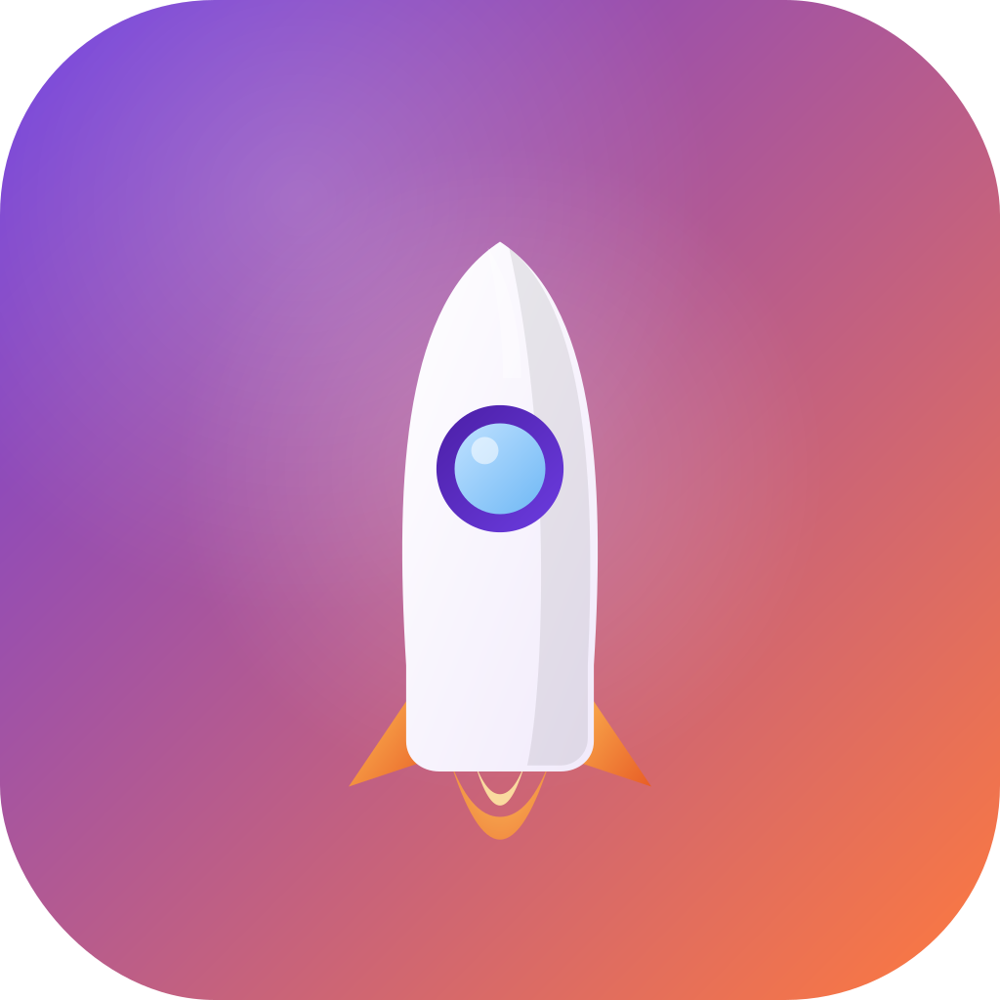

<<<<<<< HEAD
# startup_ideas

A new Flutter project.

## Getting Started

This project is a starting point for a Flutter application.

A few resources to get you started if this is your first Flutter project:

- [Learn Flutter](https://docs.flutter.dev/get-started/learn-flutter)
- [Write your first Flutter app](https://docs.flutter.dev/get-started/codelab)
- [Flutter learning resources](https://docs.flutter.dev/reference/learning-resources)

For help getting started with Flutter development, view the
[online documentation](https://docs.flutter.dev/), which offers tutorials,
samples, guidance on mobile development, and a full API reference.
=======
<div align="center">



# 🚀 Startup Ideas Evaluator

### Pitch your startup idea. Let AI score it. Climb the leaderboard.

[](https://flutter.dev)
[](https://dart.dev)
[](https://bloclibrary.dev)
[](#-license)

<br/>


</div>

---

## 📖 About

**Startup Ideas Evaluator** is a Flutter app where anyone can pitch a startup idea, get it instantly scored by a built-in AI evaluator, vote for the pitches you love, and see how they stack up on a live Top 5 leaderboard.

It's built as a clean, modern reference app showcasing **BLoC/Cubit state management**, custom **gradient-themed Material 3 UI**, smooth animations, and a polished light/dark theme — from a glowing animated splash screen down to the app icon itself.

<div align="center">
<table>
<tr>
<td align="center" width="25%"><b>🚀 Pitch</b><br/><sub>Submit your idea</sub></td>
<td align="center" width="25%"><b>🤖 AI Score</b><br/><sub>Instant evaluation</sub></td>
<td align="center" width="25%"><b>👍 Vote</b><br/><sub>Support great ideas</sub></td>
<td align="center" width="25%"><b>🏆 Compete</b><br/><sub>Top 5 leaderboard</sub></td>
</tr>
</table>
</div>

---

## 📸 Screenshots


---

## ✨ Features

- 🎯 **Pitch submission** — name, tagline, and description with real-time form validation
- 🤖 **AI-style evaluation** — every idea is instantly scored (0–100) with a short verdict
- 👍 **One-tap voting** — upvote pitches you believe in, with animated feedback
- 📊 **Sortable idea feed** — sort by votes or AI score from the app bar
- 🏆 **Top 5 leaderboard** — gold / silver / bronze podium styling with staggered entrance animations
- 🌗 **Light & dark themes** — fully tuned color palettes, glowing gradient effects in both modes
- 🎬 **Animated splash screen** — pulsing glow, orbiting ring, flickering thruster flame, and rising particles
- 📤 **Share pitches** — share any idea directly via `share_plus`
- 💾 **Local persistence** — ideas and votes saved with `shared_preferences`
- 🎨 **Custom gradient design system** — consistent glowing gradient UI across app bar, cards, buttons, and empty states
- 🧩 **Cubit-based navigation** — clean, testable bottom navigation state

---

## 🛠️ Tech Stack

| Category | Technology |
|---|---|
| **Framework** | [Flutter](https://flutter.dev) (Dart 3.13) |
| **State Management** | [flutter_bloc](https://pub.dev/packages/flutter_bloc) / [bloc](https://pub.dev/packages/bloc) (Bloc + Cubit) |
| **Value Equality** | [equatable](https://pub.dev/packages/equatable) |
| **Local Storage** | [shared_preferences](https://pub.dev/packages/shared_preferences) |
| **Unique IDs** | [uuid](https://pub.dev/packages/uuid) |
| **Sharing** | [share_plus](https://pub.dev/packages/share_plus) |
| **Typography** | [google_fonts](https://pub.dev/packages/google_fonts) |
| **App Icon Generation** | [flutter_launcher_icons](https://pub.dev/packages/flutter_launcher_icons) |
| **Design** | Material 3, custom gradient theming, `CustomPainter` animations |

---

## 📂 Project Structure

```
lib/
├── core/
│   └── utils/
│       └── ai_evaluator.dart          # Scoring logic for submitted ideas
├── features/
│   └── home/
│       ├── domain/
│       │   └── entities/
│       │       └── startup_ideas.dart # StartupIdea model
│       └── presentation/
│           ├── bloc/                  # IdeaBloc (events, states)
│           ├── cubit/                 # ThemeCubit, NavigationCubit
│           ├── pages/
│           │   ├── splash_page.dart
│           │   ├── main_navigation_page.dart
│           │   ├── idea_submission_page.dart
│           │   ├── idea_listing_page.dart
│           │   └── leaderboard_page.dart
│           └── widgets/
│               └── custom_appBar.dart
└── main.dart
```

---

## 🚀 Getting Started

### Prerequisites

- [Flutter SDK](https://docs.flutter.dev/get-started/install) `>= 3.x`
- Dart SDK `^3.13.2` (bundled with Flutter)
- Android Studio / Xcode (for emulators) or a physical device
- A code editor — [VS Code](https://code.visualstudio.com/) or Android Studio recommended

Check your setup any time with:

```bash
flutter doctor
```

### Run Locally

```bash
# 1. Clone the repository
git clone https://github.com/<your-username>/startup_ideas.git
cd startup_ideas

# 2. Install dependencies
flutter pub get

# 3. Generate the app icon (only needed once, or after changing icon assets)
dart run flutter_launcher_icons

# 4. Run the app
flutter run
```

To target a specific platform:

```bash
flutter run -d chrome     # Web
flutter run -d windows    # Windows desktop
flutter run -d macos      # macOS desktop
flutter devices           # List all available devices/emulators
```

### Build a Release

```bash
# Android APK
flutter build apk --release

# Android App Bundle (for Play Store)
flutter build appbundle --release

# iOS (requires macOS + Xcode)
flutter build ios --release
```

---

## 📱 Install the APK

Want to try it without building from source?

1. Go to the [**Releases**](https://github.com/<your-username>/startup_ideas/releases) page of this repository.
2. Download the latest `app-release.apk`.
3. On your Android device, enable **Install from Unknown Sources** (`Settings → Security` or `Settings → Apps → Special access`).
4. Open the downloaded APK and tap **Install**.

> ⚠️ Since this isn't distributed via the Play Store, Android will warn you before installing — this is expected for sideloaded APKs.

---

## 🎨 Design Highlights

- **Gradient design language** — a consistent `primary → tertiary` gradient runs through the app bar, buttons, badges, and cards.
- **Adaptive light/dark tuning** — glow intensity, shadows, and color blends are tuned independently for each theme rather than just toggling opacity.
- **Micro-interactions** — animated vote icons, rotating orbit rings, flickering flame effects, and staggered leaderboard entrances.

---

## 🤝 Contributing

Contributions, issues, and feature requests are welcome!

1. Fork the project
2. Create your feature branch (`git checkout -b feature/amazing-feature`)
3. Commit your changes (`git commit -m 'Add some amazing feature'`)
4. Push to the branch (`git push origin feature/amazing-feature`)
5. Open a Pull Request

---

## 📄 License

This project is licensed under the **MIT License** — see the [LICENSE](LICENSE) file for details.

---

<div align="center">

Made with ❤️ and Flutter

</div>
>>>>>>> c67af0d7867d769a576deb35e87add98769aaed5
